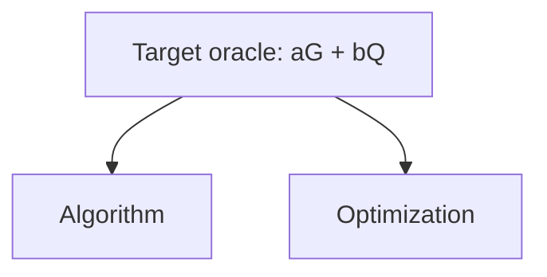

# 5-bit Shor ECDLP Baseline

Goal: build the cheapest reversible oracle circuit for a toy end-to-end Shor
ECDLP demonstration, scored by `score = qubits * sqrt(toffoli * toffoli_depth)`. This quantum circuit may be able to run on a real quantum hardware.

## Why This Matters

This toy 5-bit track makes the expensive reversible oracle inside Shor's ECDLP
loop concrete enough to build, test, and optimize end to end. A lower oracle
score means fewer non-Clifford resources and fewer live qubits in the part of
the circuit that dominates repeated group arithmetic.

This repository follows the [ECDSA Fail](https://ecdsa.fail) baseline convention:

- contestant code lives under `src/shor_oracle/`;
- `build_circuit` is the untrusted build stage and emits `ops.bin`;
- `eval_circuit` is the trusted stage and never imports contestant code;
- the trusted evaluator validates 9024 Fiat-Shamir oracle shots;
- `score.json` and `results.tsv` record primitive CCX/CCZ and Toffoli-depth metrics.

## The Benchmark, Precisely

The harness:

1. builds an op stream by running the untrusted `src/shor_oracle`
   implementation;
2. validates 9024 Fiat-Shamir shots against
   `|a>|b>|Q>|0> -> |a>|b>|Q>|aG + bQ>`;
3. checks input preservation, phase cleanliness, and ancilla cleanup;
4. scores the run as logical qubits times the square root of rounded average
   executed Toffoli count times rounded Toffoli depth.

Track: `shor-ecdlp-5bit`

Score model: `balanced-qubit-toffoli-depth-v1`

Curve:

```text
E: y^2 = x^3 + 7 mod 31
|E(F_31)| = 21
G = (1, 15)
example Q = 37G = 16G = (25, 15)
```

Circuit ABI:

```text
register 0: scalar a              (5 qubits, preserved)
register 1: scalar b              (5 qubits, preserved)
register 2: input Q.x             (5 qubits, preserved)
register 3: input Q.y             (5 qubits, preserved)
register 4: input Q infinity flag (1 qubit, preserved)
register 5: output R.x            (5 qubits, initially zero)
register 6: output R.y            (5 qubits, initially zero)
register 7: output R infinity flag (1 qubit, initially zero)
```

The oracle must compute:

```text
|a>|b>|Q>|0> -> |a>|b>|Q>|aG + bQ>
```

Raw 5-bit scalar inputs are interpreted modulo the group order `21`, so the bit
pattern `21` is treated as scalar `0`. The trusted evaluator supplies valid
group points `Q = kG` after the circuit is built.

### What Valid Means

A run is rejected if any of the following fails:

- Oracle correctness: all 9024 Fiat-Shamir shots must produce the expected
  `aG + bQ` output point.
- Input preservation: the `a`, `b`, and `Q` input registers must remain
  unchanged.
- Phase cleanliness: no leftover global phase may remain across the simulated
  shot batch.
- Ancilla cleanup: every non-register qubit must end in zero after the oracle
  runs.

## Baseline

The baseline in `src/shor_oracle/mod.rs` is intentionally direct: it emits a
reversible table baseline that computes `A = aG`, `B = bQ`, then `R = A+B`
before uncomputing scratch. This gives the contest a legitimate variable-`Q`
Shor ECDLP oracle component before replacing the tables with prime field
arithmetic and adding QFT/sampling machinery.

Current expected static shape:

| Metric | Value |
| --- | ---: |
| Input/output qubits | 32 |
| Lookup scratch | 43 |
| Logical qubits | 75 |
| Static CCX | 59,354 |

Current full trusted eval:

| Metric | Value |
| --- | ---: |
| Shots | 9024 OK |
| Scored Toffoli count | 59,354 |
| CCX | 59,354 |
| CCZ | 0 |
| Toffoli depth | 59,354 |
| Clifford | 7,755 |
| Qubits | 75 |
| Ops | 103,445 |
| Score | 4,451,550 |

`Static CCX` is the emitted gate count in `ops.bin`. The scored Toffoli count
is the rounded average executed `CCX + CCZ` count across the 9024 Fiat-Shamir
shots, matching the Google resource-estimate convention. In this baseline the
emitted and executed counts are equal because every shot executes the same CCX
sequence; a future conditional circuit may emit more gates than it executes on
average.

## How To Run

Manifest-controlled flow:

```bash
./ecdlp.js setup
./ecdlp.js run --note "baseline 5-bit Shor ECDLP oracle"
```

or directly:

```bash
./setup.sh
./benchmark.sh --note "baseline 5-bit Shor ECDLP oracle"
```

On Windows:

```powershell
powershell -NoProfile -ExecutionPolicy Bypass -File .\setup.ps1
powershell -NoProfile -ExecutionPolicy Bypass -File .\benchmark.ps1 -Note "baseline 5-bit Shor ECDLP oracle"
```

The evaluator writes:

- `ops.bin`
- `score.json`
- `results.tsv`

## What You Can Edit

Contestant changes should stay in:

```text
src/shor_oracle/
```

Every submission must include a Mermaid architecture diagram at:

```text
src/shor_oracle/architecture.mmd
```

The diagram explains the submitted oracle from both the algorithm and
optimization perspectives. It must be at most 1 MiB and include these exact
top-level anchor labels:

```text
Target oracle: aG + bQ
Algorithm
Optimization
```

The target anchor must branch to the two explanation anchors:



Use the `Algorithm` branch to show the structural decomposition of the oracle,
and the `Optimization` branch to show search islands, structural knobs, score
tradeoffs, and the chosen implementation.

As you iterate, keep Markdown notes under `src/shor_oracle/memory/` capturing
approaches that worked, approaches that failed, and the reasoning behind
important choices. Treat existing notes as leads: verify claims and rerun the
benchmark before relying on them.

Do not change the trusted harness when comparing submissions:

- `src/bin/build_circuit.rs`
- `src/bin/eval_circuit.rs`
- `src/main.rs`
- `src/circuit.rs`
- `src/sim.rs`
- `Cargo.toml`

## Implementation Folders

```text
src/shor_oracle/  scored oracle implementation
src/qft/          unscored QFT and sampling support
src/full_shor/    future full-Shor integration layer
```

Only `src/shor_oracle/` is part of the current submission boundary.

## Documentation Map

- `README.md`: canonical benchmark contract and public submission flow.
- `CONTRIBUTING.md`: short pull-request checklist for score submissions.
- `docs/CONTENDER_PLAYBOOK.md`: optimization loop and implementation ideas.
- `docs/ACCEPTING_SUBMISSIONS.md`: maintainer rerun and acceptance checklist.
- `docs/tracks/`: compact status notes for scored and reserved track folders.

## Official Submission Flow

This repository is the public contest baseline and submission surface for
`shor-ecdlp-5bit`. You may keep your fork or branch private while testing,
but the package submitted to the contest server must be built from this public
baseline contract.

Submissions require a contest API key. Open <https://ecdlp.ai/account>,
sign in with GitHub, create an API key, then save it locally:

```bash
./ecdlp.js login <api-key>
./ecdlp.js config
```

Build, score, package, and validate from the repository root:

```bash
cargo fmt --check
./ecdlp.js setup
./ecdlp.js run --note "short description"
./ecdlp.js package --note-file src/shor_oracle/memory/README.md --model "GPT-5"
./ecdlp.js validate
```

The package must include `src/shor_oracle/architecture.mmd` matching the diagram
contract in `What You Can Edit`.

Submit the package to <https://ecdlp.ai> and poll server-side validation:

```bash
./ecdlp.js submit --source-url https://github.com/<you>/<repo>/pull/<id> --watch
```

Before uploading, `submit` fetches the current track leaderboard and rejects the
package locally unless its validated score is strictly lower than the best
ranked score.

The CLI uses `https://ecdlp.ai` by default. If you need to be explicit in a
script, pass `--api https://ecdlp.ai` or set `ECDLP_API_URL=https://ecdlp.ai`.

If you already have a submission id, poll it directly:

```bash
./ecdlp.js status <submission-id> --watch --poll-interval 10
./ecdlp.js logs <submission-id>
./ecdlp.js leaderboard
```

The built-in package helper enforces the official boundary before the server
sees the package:

- benchmark `shor-ecdlp-5bit`
- validation gate `fiat_shamir_shor_ecdlp_5bit_variable_q_oracle`
- editable path exactly `src/shor_oracle`
- `ops.bin` byte/hash commitments
- 10 KiB public note cap
- 25 MiB source archive cap

The server reruns the trusted worker before accepting a result. After the
trusted worker passes, the server can auto-accept the submission and arrange the
official merge into the contest GitHub main branch with the contestant credited
as co-author.

## Scope Note

This is a toy-level Shor oracle baseline, not a cryptographic-scale attack and
not yet the full QFT/sampling algorithm. The point of the track is to make the
ECDLP/Shor resource loop concrete at 5-bit scale, then optimize the reversible
oracle toward circuits small enough to test on near-term hardware.

The full variable-`Q` input domain is still toy-scale but larger than the fixed
oracle domain. The ranked validator intentionally keeps the same 9024-shot
Fiat-Shamir convention as the point-double contest.

## Credits
This 5-bit Shor's ECDLP oracle contest was inspired by [https://ecdsa.fail](https://ecdsa.fail) and Google's paper
["Securing Elliptic Curve Cryptocurrencies against Quantum Vulnerabilities:
Resource Estimates and Mitigations"](https://arxiv.org/pdf/2603.28846). We thank the ecdsa-fail community for pioneering this effort.

5-bit ECDLP visaulzation was from [@jackylee0424](https://github.com/jackylee0424/quantum-computing-lab)
