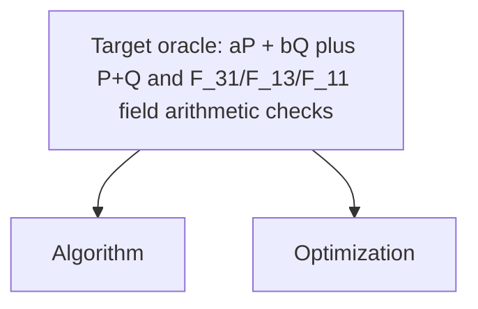

# 5-bit Shor ECDLP Oracle Baseline

Goal: build the cheapest reversible oracle circuit for a 5-bit toy Shor ECDLP
oracle, scored by `score = qubits * sqrt(toffoli * toffoli_depth)`, where
`toffoli` is the rounded average executed Toffoli count and `toffoli_depth` is
the rounded average per-shot executed Toffoli depth. This is an important step aiming for running the full Shor's ECDLP algorithm on quantum hardware.

## Why This Matters

This toy 5-bit track makes the expensive reversible oracle inside Shor's ECDLP
loop concrete enough to build, test, and optimize end to end. A lower oracle
score means fewer non-Clifford resources and fewer live qubits in the part of
the circuit that dominates repeated group arithmetic.

This repository follows the [ECDSA Fail](https://ecdsa.fail) baseline convention:

- contestant code lives under `src/shor_oracle/`;
- `build_circuit` is the untrusted build stage and emits `ops.bin`;
- `eval_circuit` is the trusted stage and never imports contestant code;
- the trusted evaluator validates 9024 Fiat-Shamir oracle shots;
- `score.json` and `results.tsv` record primitive CCX/CCZ and Toffoli-depth metrics.

## AI Agent Quick Start

If you are using an AI coding agent, paste this prompt into the agent:

```text
Install the 5-bit Shor ECDLP contest CLI and open the contest repo:

curl -fsSL https://ecdlp.ai/install.sh | sh
cd "$(ecdlp repo)"

Use the CLI help to learn the workflow before acting:

ecdlp --help
ecdlp setup --help
ecdlp run --help
ecdlp package --help
ecdlp validate --help
ecdlp submit --help

Then read README.md, benchmark.json, ./ecdlp.js,
src/shor_oracle/mod.rs, src/shor_oracle/architecture.mmd, and
src/shor_oracle/memory/README.md.

Goal: improve the scored oracle under src/shor_oracle/ only. Do not edit the
trusted harness, Cargo.toml, Cargo.lock, rust-toolchain, score.json, ops.bin, or
results.tsv by hand.

Use repo-local build and scratch paths under .workspace/ to avoid permission
issues. This repo already routes Cargo builds to .workspace/target. If you need
extra caches, generated probes, temporary files, or tool downloads, put them
under .workspace/ and do not rely on system/global writable directories.

Local work does not require an API key. The user only needs to sign in with
GitHub and create an API key when they are ready to submit to ecdlp.ai.

Use this local loop:
1. Run ecdlp setup if the repo is not already prepared.
2. Modify src/shor_oracle/ and update src/shor_oracle/architecture.mmd plus
   src/shor_oracle/memory/README.md with the approach and result.
3. Run cargo fmt --check and ecdlp run --note "short description".
4. Package with ecdlp package --note-file src/shor_oracle/memory/README.md --model "<model-name>".
5. Run ecdlp validate before proposing submission.

A valid submission must beat the current best score, preserve the documented
oracle ABI, pass all 9024 trusted shots, include the Mermaid architecture
diagram, and explain the algorithm and optimization choices in the note.

When ready to submit, ask the user to open https://ecdlp.ai/account, sign in
with GitHub, create an API key, and run:

ecdlp login <api-key>
ecdlp submit --watch
```

## Benchmark

The harness:

1. builds an op stream by running the untrusted `src/shor_oracle`
   implementation;
2. validates 9024 Fiat-Shamir shots against
   `|a>|b>|P>|Q>|field inputs>|0> -> |a>|b>|P>|Q>|field inputs>|aP + bQ>|P+Q>|2P>|field witnesses>`;
3. checks point addition, point doubling, selector-based `F_31`, `F_13`, and `F_11` field arithmetic
   witnesses, input preservation, phase cleanliness, and ancilla cleanup;
4. scores the run as logical qubits times the square root of rounded average
   executed Toffoli count times rounded average per-shot executed Toffoli depth.

Track: `shor-ecdlp-5bit`

Score model: `balanced-qubit-toffoli-depth-v1`

Curve:

```text
E: y^2 = x^3 + 7 mod 31
|E(F_31)| = 21
sampler base point = (1, 15)
example Q = 37B = 16B = (25, 15)
```

Circuit ABI:

```text
register 0: scalar a              (5 qubits, preserved)
register 1: scalar b              (5 qubits, preserved)
register 2: input P.x             (5 qubits, preserved)
register 3: input P.y             (5 qubits, preserved)
register 4: input P infinity flag (1 qubit, preserved)
register 5: input Q.x             (5 qubits, preserved)
register 6: input Q.y             (5 qubits, preserved)
register 7: input Q infinity flag (1 qubit, preserved)
register 8: output R.x            (5 qubits, initially zero)
register 9: output R.y            (5 qubits, initially zero)
register 10: output R infinity flag (1 qubit, initially zero)
register 11: output (P+Q).x       (5 qubits, initially zero)
register 12: output (P+Q).y       (5 qubits, initially zero)
register 13: output (P+Q) infinity flag (1 qubit, initially zero)
register 14: output (2P).x        (5 qubits, initially zero)
register 15: output (2P).y        (5 qubits, initially zero)
register 16: output (2P) infinity flag (1 qubit, initially zero)
register 17: field selector          (2 qubits, preserved; 0=F_31, 1=F_13, 2=F_11)
register 18: field input x1          (5 qubits, preserved)
register 19: field input y1          (5 qubits, preserved)
register 20: field input x2          (5 qubits, preserved)
register 21: field input y2          (5 qubits, preserved)
register 22: field output x1+x2      (5 qubits, initially zero)
register 23: field output den=x2-x1  (5 qubits, initially zero)
register 24: field output num=y2-y1  (5 qubits, initially zero)
register 25: field output x1*y2      (5 qubits, initially zero)
register 26: field output den^-1, or 0 if den=0 (5 qubits, initially zero)
register 27: field output lambda=num/den, or 0 if den=0 (5 qubits, initially zero)
register 28: field output lambda*den (5 qubits, initially zero)
```

The oracle must compute:

```text
|a>|b>|P>|Q>|field inputs>|0> -> |a>|b>|P>|Q>|field inputs>|aP + bQ>|P+Q>|2P>|field witnesses>
```

Raw 5-bit scalar inputs are interpreted modulo the group order `21`, so the bit
pattern `21` is treated as scalar `0`. The trusted evaluator supplies valid
group points `P = sB` and `Q = tB` after the circuit is built, where `B` is the
sampler base point above.

The field-arithmetic validation registers are independent of the 5-bit curve
oracle. The trusted evaluator samples selector-driven values in `F_31`, `F_13`,
and `F_11`, including edge cases outside the order-21 subgroup shortcut, and
checks each selected field:

```text
sum = x1 + x2 mod p
den = x2 - x1 mod p
num = y2 - y1 mod p
product = x1 * y2 mod p
den_inv = den^-1 mod p, or 0 when den = 0
lambda = num * den_inv mod p, or 0 when den = 0
lambda_den = lambda * den mod p
```

### What Valid Means

A run is rejected if any of the following fails:

- Oracle correctness: all 9024 Fiat-Shamir shots must produce the expected
  `aP + bQ` output point.
- Point addition correctness: the `(P+Q)` output registers must match the
  elliptic-curve addition formula.
- Point doubling correctness: the `(2P)` output registers must match the
  elliptic-curve tangent formula.
- Field arithmetic correctness: all selected `F_31`, `F_13`, and `F_11` witness outputs must satisfy the
  trusted add, subtract, multiply, inverse, and affine-lambda equations.
- Input preservation: the `a`, `b`, `P`, `Q`, `x1`, `y1`, `x2`, and `y2` input
  registers must remain unchanged.
- Phase cleanliness: no leftover global phase may remain across the simulated
  shot batch.
- Ancilla cleanup: every non-register qubit must end in zero after the oracle
  runs.

## Baseline

The baseline in `src/shor_oracle/mod.rs` is intentionally direct: it emits a
reversible table baseline that computes `A = aP`, `B = bQ`, then `R = A+B`,
also writing the explicit `P+Q`, `2P`, and `F_31`, `F_13`, and `F_11` field-witness check outputs
before uncomputing scratch. This gives the contest a legitimate variable-base
Shor ECDLP oracle component before replacing the tables with prime field
arithmetic and adding QFT/sampling machinery.

Current expected static shape:

| Metric | Value |
| --- | ---: |
| Input/output qubits | 127 |
| Lookup scratch | 49 |
| Logical qubits | 176 |
| Static CCX | 248,013 |

Current full trusted eval:

| Metric | Value |
| --- | ---: |
| Shots | 9024 OK |
| Scored Toffoli count | 248,013 |
| CCX | 248,013 |
| CCZ | 0 |
| Avg. executed Toffoli depth | 129,909 |
| Clifford | 28,920 |
| Qubits | 176 |
| Ops | 434,550 |
| Score | 31,591,446.412397645 |

`Static CCX` is the emitted gate count in `ops.bin`. The scored Toffoli count
is the rounded average executed `CCX + CCZ` count across the 9024 Fiat-Shamir
shots, matching the Google resource-estimate convention. In this baseline the
emitted and executed counts are equal because every shot executes the same CCX
sequence; a future conditional circuit may emit more gates than it executes on
average.

## What You Can Edit

Contestant changes should stay in:

```text
src/shor_oracle/
```

Every submission must include a Mermaid architecture diagram at:

```text
src/shor_oracle/architecture.mmd
```

The diagram explains the submitted oracle from both the algorithm and
optimization perspectives. It must be at most 1 MiB and include these exact
top-level anchor labels:

```text
Target oracle: aP + bQ plus P+Q and F_31/F_13/F_11 field arithmetic checks
Algorithm
Optimization
```

The target anchor must branch to the two explanation anchors:



Use the `Algorithm` branch to show the structural decomposition of the oracle,
and the `Optimization` branch to show search islands, structural knobs, score
tradeoffs, and the chosen implementation.

As you iterate, keep Markdown notes under `src/shor_oracle/memory/` capturing
approaches that worked, approaches that failed, and the reasoning behind
important choices. Treat existing notes as leads: verify claims and rerun the
benchmark before relying on them.

Do not change the trusted harness when comparing submissions:

- `src/bin/build_circuit.rs`
- `src/bin/eval_circuit.rs`
- `src/main.rs`
- `src/circuit.rs`
- `src/sim.rs`
- `Cargo.toml`

Implementation folders:

```text
src/shor_oracle/  scored oracle implementation; current submission boundary
src/qft/          unscored QFT and sampling support
src/full_shor/    future full-Shor integration layer
```

## Local Workflow

Use `ecdlp` after installing from `https://ecdlp.ai/install.sh`. If you cloned
the repo manually, run `./ecdlp.js` from the repo root instead.

```bash
ecdlp setup
ecdlp run --note "short description"
```

The evaluator writes `ops.bin`, `score.json`, and `results.tsv`. These are
generated benchmark artifacts; do not hand-edit them.

For a submission candidate:

```bash
cargo fmt --check
ecdlp package --note-file src/shor_oracle/memory/README.md --model "GPT-5"
ecdlp validate
```

The package helper enforces the official boundary before the server sees the
package:

- benchmark `shor-ecdlp-5bit`
- validation gate `fiat_shamir_shor_ecdlp_5bit_variable_base_point_ops_oracle_field_arithmetic_v4`
- editable path exactly `src/shor_oracle`
- `src/shor_oracle/architecture.mmd` commitment
- `ops.bin` byte/hash commitment
- 10 KiB public note cap
- 25 MiB source archive cap

Direct script entrypoints still work:

```bash
./setup.sh
./benchmark.sh --note "short description"
```

On Windows:

```powershell
powershell -NoProfile -ExecutionPolicy Bypass -File .\setup.ps1
powershell -NoProfile -ExecutionPolicy Bypass -File .\benchmark.ps1 -Note "short description"
```

## Submit

Submissions require a contest API key. Open <https://ecdlp.ai/account>, sign in
with GitHub, create an API key, then save it locally:

```bash
ecdlp login <api-key>
ecdlp config
```

Submit the validated package and poll server-side validation:

```bash
ecdlp submit --watch
```

Before uploading, `submit` fetches the current track leaderboard and rejects the
package locally unless its validated score is strictly lower than the best
ranked score. `--source-url` is optional; use it when you have a public PR you
want reviewers or merge automation to see.

If you already have a submission id, poll it directly:

```bash
ecdlp status <submission-id> --watch --poll-interval 10
ecdlp logs <submission-id>
ecdlp leaderboard
```

The server reruns the trusted worker before accepting a result. After the
trusted worker passes, the server can auto-accept the submission and arrange the
official merge into the contest GitHub main branch with the contestant credited
as co-author.

## Documentation Map

- `README.md`: canonical benchmark contract and public submission flow.
- `CONTRIBUTING.md`: short pull-request checklist for score submissions.
- `docs/CONTENDER_PLAYBOOK.md`: optimization strategy and implementation ideas.
- `docs/ACCEPTING_SUBMISSIONS.md`: maintainer rerun and acceptance checklist.
- `docs/tracks/`: compact status notes for scored and reserved track folders.

## Scope Note

This is a toy-level Shor oracle baseline, not a cryptographic-scale attack and
not yet the full QFT/sampling algorithm. The point of the track is to make the
ECDLP/Shor resource loop concrete at 5-bit scale, then optimize the reversible
oracle toward circuits small enough to test on near-term hardware.

The full variable-`Q` input domain is still toy-scale but larger than the fixed
oracle domain. The ranked validator intentionally keeps the same 9024-shot
Fiat-Shamir convention as the point-double contest.

## Credits
This 5-bit Shor's ECDLP oracle contest was inspired by [https://ecdsa.fail](https://ecdsa.fail) and Google's paper
["Securing Elliptic Curve Cryptocurrencies against Quantum Vulnerabilities:
Resource Estimates and Mitigations"](https://arxiv.org/pdf/2603.28846). We thank the ecdsa-fail community for pioneering this effort.

5-bit ECDLP visualization was from [@jackylee0424](https://github.com/jackylee0424/quantum-computing-lab). We thank [@edi3on](https://github.com/edi3on) for testing and pointing out bugs.
