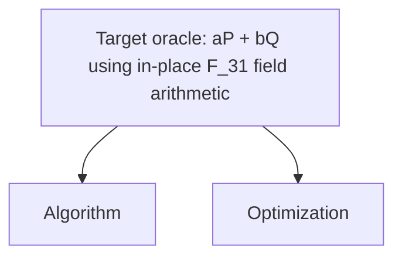

# 5-bit Shor ECDLP Oracle Baseline

Goal: build the cheapest reversible oracle circuit for a 5-bit toy Shor ECDLP
oracle, scored by `score = qubits * sqrt(toffoli * toffoli_depth)`, where
`toffoli` is the rounded average executed Toffoli count and `toffoli_depth` is
the rounded average per-shot executed Toffoli depth. This is an important step aiming for running the full Shor's ECDLP algorithm on quantum hardware.

## Why This Matters

This toy 5-bit track makes the expensive reversible oracle inside Shor's ECDLP
loop concrete enough to build, test, and optimize end to end. A lower oracle
score means fewer non-Clifford resources and fewer live qubits in the part of
the circuit that dominates repeated group arithmetic.

This repository follows the [ECDSA Fail](https://ecdsa.fail) baseline convention:

- contestant code lives in `src/shor_oracle/field_arithmetic.rs` and
  `src/shor_oracle/scalar_strategy.rs`, with required notes under
  `src/shor_oracle/memory/` and the architecture diagram at
  `src/shor_oracle/architecture.mmd`;
- `build_circuit` is the untrusted build stage and emits `ops.bin`;
- `eval_circuit` is the trusted stage and never imports contestant code;
- the trusted evaluator validates 9024 Fiat-Shamir oracle shots;
- `score.json` and `results.tsv` record primitive CCX/CCZ and Toffoli-depth metrics.

## AI Agent Quick Start

If you are using an AI coding agent, paste this prompt into the agent:

```text
Install the 5-bit Shor ECDLP contest CLI and open the contest repo:

curl -fsSL https://ecdlp.ai/install.sh | sh
cd "$(ecdlp repo)"

Use the CLI help to learn the workflow before acting:

ecdlp --help
```

## Benchmark

The harness:

1. builds an op stream by running the trusted oracle composer with the
   submitted `src/shor_oracle/field_arithmetic.rs` implementation and
   `src/shor_oracle/scalar_strategy.rs` schedule;
2. validates 9024 Fiat-Shamir shots against
   `|a>|b>|P>|Q>|0> -> |a>|b>|P>|Q>|aP + bQ>`;
3. checks oracle correctness, in-place `F_31` field-arithmetic composition,
   restricted scalar-strategy API use, input preservation, phase cleanliness,
   and ancilla cleanup;
4. scores the run as logical qubits times the square root of rounded average
   executed Toffoli count times rounded average per-shot executed Toffoli depth.

Track: `shor-ecdlp-5bit`

Score model: `balanced-qubit-toffoli-depth-v1`

Curve:

```text
E: y^2 = x^3 + 7 mod 31
|E(F_31)| = 21
sampler base point = (1, 15)
example Q = 37B = 16B = (25, 15)
```

Circuit ABI:

```text
register 0: scalar a              (5 qubits, preserved)
register 1: scalar b              (5 qubits, preserved)
register 2: input P.x             (5 qubits, preserved)
register 3: input P.y             (5 qubits, preserved)
register 4: input P infinity flag (1 qubit, preserved)
register 5: input Q.x             (5 qubits, preserved)
register 6: input Q.y             (5 qubits, preserved)
register 7: input Q infinity flag (1 qubit, preserved)
register 8: output R.x            (5 qubits, initially zero)
register 9: output R.y            (5 qubits, initially zero)
register 10: output R infinity flag (1 qubit, initially zero)
```

The oracle must compute:

```text
|a>|b>|P>|Q>|0> -> |a>|b>|P>|Q>|aP + bQ>
```

Raw 5-bit scalar inputs are interpreted modulo the group order `21`, so the bit
pattern `21` is treated as scalar `0`. The trusted evaluator supplies valid
group points `P = sB` and `Q = tB` after the circuit is built, where `B` is the
sampler base point above.

The scored ABI intentionally has no hidden field-test registers. The only field
in the scored circuit is the curve field `F_31`; the trusted evaluator checks
only the oracle output and does not run hidden extra-modulus probes such as
`field_add_kernel(F_17)` or `field_mul_kernel(F_19)`. Submissions are expected
to implement reversible arithmetic over the five-bit `F_31` field elements.
Point-level lookup tables are outside the contest contract even if they happen
to pass the black-box shots. The editable code boundary gives
`field_arithmetic.rs` only opaque per-field operands and targets and gives
`scalar_strategy.rs` only opaque scalar-bit and point handles. Contenders may
choose how to store, recompute, and clear arithmetic point powers, but they
cannot select from point tables, inspect public point registers, or emit raw
gates.

### What Valid Means

A run is rejected if any of the following fails:

- Oracle correctness: all 9024 Fiat-Shamir shots must produce the expected
  `aP + bQ` output point.
- In-place field arithmetic composition: the submitted field-arithmetic source
  must stay inside the opaque field-kernel facade. It must not import raw qubit
  IDs, raw circuit ops, the trusted builder, unsafe code, mutable global state,
  external data, or process/environment state.
- Restricted scalar strategy API: the submitted scalar-strategy source may call
  only the opaque `scalar_api` methods for allocating scratch points, computing
  arithmetic doubles, and applying controlled adds. It must not import raw
  qubits, point registers, trusted point internals, table-like containers,
  unsafe code, mutable global state, external data, or process/environment
  state.
- Input preservation: the `a`, `b`, `P`, and `Q` input registers must remain
  unchanged.
- Phase cleanliness: no leftover global phase may remain across the simulated
  shot batch.
- Ancilla cleanup: every non-register qubit must end in zero after the oracle
  runs.

## Baseline

The baseline is intentionally arithmetic-first. Trusted
`src/shor_oracle/mod.rs` fixes the oracle shape and affine point formulas.
Editable `src/shor_oracle/scalar_strategy.rs` dynamically precomputes `2P`,
`4P`, `8P`, and `16P` for each input point, uses those point powers for the
controlled scalar-add steps, and uncomputes the chain in reverse through the
trusted opaque scalar API. Trusted
`src/shor_oracle/builder.rs` owns register allocation, scratch allocation,
segment boundaries, primitive op emission, and compute/copy/uncompute mechanics.
`src/shor_oracle/field_arithmetic.rs` provides the reversible `F_31` add,
subtract, multiply, and inverse kernels through an opaque field-only emitter.
The network computes `A = aP`, `B = bQ`, and `R = A+B` into bounded scratch
registers, copies the oracle output into the ABI output registers, and then runs
the scratch network backward.

Current expected static shape for the table-free field-circuit baseline:

| Metric | Value |
| --- | ---: |
| Input/output qubits | 43 |
| Peak scratch and intermediates | 283 |
| Logical qubits | 326 |
| Static CCX | 4,624,825 |
| Emitted ops | 25,749,133 |

Current full trusted eval, measured with `ECDLP_EVAL_THREADS=8`:

| Metric | Value |
| --- | ---: |
| Shots | 9024 OK |
| Scored Toffoli count | 4,624,825 |
| CCX | 4,624,825 |
| CCZ | 0 |
| Avg. executed Toffoli depth | 3,477,469 |
| Clifford | 13,980,686 |
| Qubits | 326 |
| Ops | 25,749,133 |
| Score | 1,307,365,094.9206183 |

Practical system requirements for this table-free baseline:

| Requirement | Observed / Recommended |
| --- | --- |
| Build memory | 0.67 GiB peak working set for `build_circuit` on the current 25.7M-op artifact |
| Eval memory | 1.35 GiB peak working set for the full 9024-shot trusted eval |
| Recommended RAM | 16 GiB for OS and toolchain headroom; 32 GiB is comfortable |
| 32 GiB machines | Supported for the current full trusted eval |
| Eval parallelism | `ecdlp run` defaults to `ECDLP_EVAL_THREADS=8`; set the variable explicitly to override it |
| Observed CPU use | 8 trusted eval workers; CPU utilization was not separately sampled in this measurement |
| Observed build time | 3.18 seconds wall-clock using the existing release `build_circuit` binary |
| Observed eval time | 55.97 seconds wall-clock using the release eval test harness with 8 workers |
| Build plus eval time | About 59 seconds for measured release-binary build plus trusted eval, excluding Cargo compile/startup overhead |
| Artifact size | `ops.bin` was 20,693,456 bytes in compressed format |

This explicit-arithmetic baseline is intentionally conservative for the
no-table audit, but it is heavy for contest iteration. The compact contest
contract should distinguish field-kernel implementation from forbidden
point/scalar/oracle lookup tables if fast local validation is a priority.

`Static CCX` is the emitted gate count in `ops.bin`. The scored Toffoli count is
the rounded average executed `CCX + CCZ` count across the 9024 Fiat-Shamir shots,
matching the Google resource-estimate convention. The current baseline uses
compute/copy/uncompute segments so field arithmetic is in-place at the oracle
contract level: computed field values are copied only into required point-output
registers or held point registers, then arithmetic scratch is uncomputed. The
trusted builder expands field operations into reversible add/subtract circuits,
cyclic-shift multiplication over the Mersenne modulus, and an exponentiation
chain for inverse; multiplication by constant `3` is emitted as one direct
Mersenne add of `x + rot1(x)` instead of a materialized expression tree. Field
multiplication also copies the first selected rotated term directly instead of
adding it to zero, and modular addition materializes the end-around-reduced bits
plus the `31 -> 0` all-ones flag once before copying to the output. It does not
synthesize field kernels from enumerated truth tables. A competitive submission
should reduce field-kernel gates without
turning the point/scalar layer into a lookup oracle.

## What You Can Edit

Contestant code changes should stay in:

```text
src/shor_oracle/field_arithmetic.rs
src/shor_oracle/scalar_strategy.rs
src/shor_oracle/architecture.mmd
src/shor_oracle/memory/
```

Every submission must include a Mermaid architecture diagram at:

```text
src/shor_oracle/architecture.mmd
```

The diagram explains the submitted oracle from both the algorithm and
optimization perspectives. It must be at most 1 MiB and include these exact
top-level anchor labels:

```text
Target oracle: aP + bQ using in-place F_31 field arithmetic
Algorithm
Optimization
```

The target anchor must branch to the two explanation anchors:



Use the `Algorithm` branch to show the structural decomposition of the trusted
oracle composer and the field kernels it calls. Use the `Optimization` branch
to show search islands, structural knobs, score tradeoffs, and the chosen field
arithmetic implementation.

As you iterate, keep Markdown notes under `src/shor_oracle/memory/` capturing
approaches that worked, approaches that failed, and the reasoning behind
important choices. Treat existing notes as leads: verify claims and rerun the
benchmark before relying on them.

Do not change the trusted harness when comparing submissions:

- `src/bin/build_circuit.rs`
- `src/bin/eval_circuit.rs`
- `src/shor_oracle/mod.rs`
- `src/main.rs`
- `src/circuit.rs`
- `src/sim.rs`
- `Cargo.toml`

Implementation folders:

```text
src/shor_oracle/mod.rs              trusted scored oracle composer
src/shor_oracle/scalar_api.rs       trusted opaque scalar-scheduling facade
src/shor_oracle/builder.rs          trusted builder, op emitter, and field facade
src/shor_oracle/field_arithmetic.rs submitted reversible field-arithmetic implementation
src/shor_oracle/scalar_strategy.rs  submitted scalar point-power schedule
src/qft/                            unscored QFT and sampling support
src/full_shor/                      future full-Shor integration layer
```

## Local Workflow

Use `ecdlp` after installing from `https://ecdlp.ai/install.sh`. If you cloned
the repo manually, run `./ecdlp.js` from the repo root instead.

```bash
ecdlp setup
ecdlp run --note "short description"
```

The evaluator writes `ops.bin`, `score.json`, and `results.tsv`. These are
generated benchmark artifacts; do not hand-edit them.

### Permission-Safe Local Build

Keep Cargo outputs and temporary files inside `.workspace/`. This avoids
permission and application-control failures from external temp or target
directories.

PowerShell:

```powershell
New-Item -ItemType Directory -Force .workspace\target, .workspace\tmp | Out-Null
$env:CARGO_TARGET_DIR = (Resolve-Path .workspace\target).Path
$env:TMP = (Resolve-Path .workspace\tmp).Path
$env:TEMP = (Resolve-Path .workspace\tmp).Path
cargo build --locked --release --bin build_circuit --bin eval_circuit
$env:ECDLP_EVAL_THREADS = "8"
cargo run --locked --release --bin eval_circuit
```

Bash:

```bash
mkdir -p .workspace/target .workspace/tmp
export CARGO_TARGET_DIR="$PWD/.workspace/target"
export TMPDIR="$PWD/.workspace/tmp"
cargo build --locked --release --bin build_circuit --bin eval_circuit
ECDLP_EVAL_THREADS=8 cargo run --locked --release --bin eval_circuit
```

The expected local binary paths are:

```text
.workspace/target/release/build_circuit
.workspace/target/release/eval_circuit
```

For a submission candidate:

```bash
cargo fmt --check
ecdlp preflight
ecdlp run --note "short description"
ecdlp package --note-file src/shor_oracle/memory/README.md --model "GPT-5"
ecdlp validate
```

Pull requests should use the cheap preflight path (`cargo fmt --check`,
`cargo check --locked`, `cargo test --locked --lib`, and `ecdlp preflight`).
The full 9024-shot trusted evaluator is reserved for validating score claims
and submission packages.

The package helper enforces the official boundary before the server sees the
package:

- benchmark `shor-ecdlp-5bit`
- validation gate `fiat_shamir_shor_ecdlp_5bit_arithmetic_strategy_oracle_v2`
- editable paths exactly `src/shor_oracle/field_arithmetic.rs`,
  `src/shor_oracle/scalar_strategy.rs`, `src/shor_oracle/architecture.mmd`, and
  `src/shor_oracle/memory`
- field-arithmetic source guard forbidding raw qubits, raw ops, trusted-builder
  access, unsafe code, mutable global state, external data, and process state
- scalar-strategy source guard forbidding raw qubits, raw ops, raw point
  registers, trusted point internals, table-like containers, unsafe code,
  mutable global state, external data, and process state
- `src/shor_oracle/architecture.mmd` commitment
- `ops.bin` byte/hash commitment
- 10 KiB public note cap
- 25 MiB source archive cap

Direct script entrypoints still work:

```bash
./setup.sh
./benchmark.sh --note "short description"
```

On Windows:

```powershell
powershell -NoProfile -ExecutionPolicy Bypass -File .\setup.ps1
powershell -NoProfile -ExecutionPolicy Bypass -File .\benchmark.ps1 -Note "short description"
```

## Submit

Submissions require a contest API key. Open <https://ecdlp.ai/account>, sign in
with GitHub, create an API key, then save it locally:

```bash
ecdlp login <api-key>
ecdlp config
```

Submit the validated package and poll server-side validation:

```bash
ecdlp submit --watch
```

Before uploading, `submit` fetches the current track leaderboard and rejects the
package locally unless its validated score is strictly lower than the best
ranked score. `--source-url` is optional; use it when you have a public PR you
want reviewers or merge automation to see.

If you already have a submission id, poll it directly:

```bash
ecdlp status <submission-id> --watch --poll-interval 10
ecdlp logs <submission-id>
ecdlp leaderboard
```

The server reruns the trusted worker before accepting a result. After the
trusted worker passes, the server can auto-accept the submission and arrange the
official merge into the contest GitHub main branch with the contestant credited
as co-author.

## Documentation Map

- `README.md`: canonical benchmark contract and public submission flow.
- `CONTRIBUTING.md`: short pull-request checklist for score submissions.
- `docs/CONTENDER_PLAYBOOK.md`: optimization strategy and implementation ideas.
- `docs/ACCEPTING_SUBMISSIONS.md`: maintainer rerun and acceptance checklist.
- `docs/tracks/`: compact status notes for scored and reserved track folders.

## Scope Note

This is a toy-level Shor oracle baseline, not a cryptographic-scale attack and
not yet the full QFT/sampling algorithm. The point of the track is to make the
ECDLP/Shor resource loop concrete at 5-bit scale, then optimize the reversible
oracle toward circuits small enough to test on near-term hardware.

The full variable-`Q` input domain is still toy-scale but larger than the fixed
oracle domain. The ranked validator intentionally keeps the same 9024-shot
Fiat-Shamir convention as the point-double contest.

## Credits
This 5-bit Shor's ECDLP oracle contest was inspired by [https://ecdsa.fail](https://ecdsa.fail) and Google's paper
["Securing Elliptic Curve Cryptocurrencies against Quantum Vulnerabilities:
Resource Estimates and Mitigations"](https://arxiv.org/pdf/2603.28846). We thank the ecdsa-fail community for pioneering this effort.

5-bit ECDLP visualization was from [@jackylee0424](https://github.com/jackylee0424/quantum-computing-lab). We thank [@edi3on](https://github.com/edi3on) for testing and pointing out bugs.
